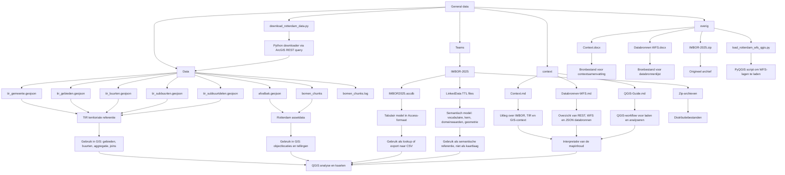

# General Data Flowchart

Dit diagram beschrijft wat er in `General data` staat en hoe de bestanden inhoudelijk met elkaar samenhangen.

## Leeshulp

- `Data` bevat de **lokale GIS-bestanden** die direct bruikbaar zijn in QGIS of Python.
- `context` bevat de **uitlegdocumenten** die beschrijven wat de data is en hoe je die gebruikt.
- `Teams/IMBOR-2025` bevat het **IMBOR-model** als Access-database en Linked Data.
- `overig` bevat de **ruwe bronbestanden** en een PyQGIS-script.
- `download_rotterdam_data.py` is de schakel tussen de online Rotterdam-services en de lokale bestanden in `Data`.

## Kernboodschap

De map combineert vier soorten informatie:

1. **Lokale GIS-data** voor directe analyse
2. **Contextdocumentatie** voor begrip en workflow
3. **IMBOR referentiemodel** voor semantiek en domeinwaarden
4. **Scripts** om data in te laden of te downloaden

Samen vormen die een workflow van brondata en modelinformatie naar QGIS-analyse en kaartproductie.