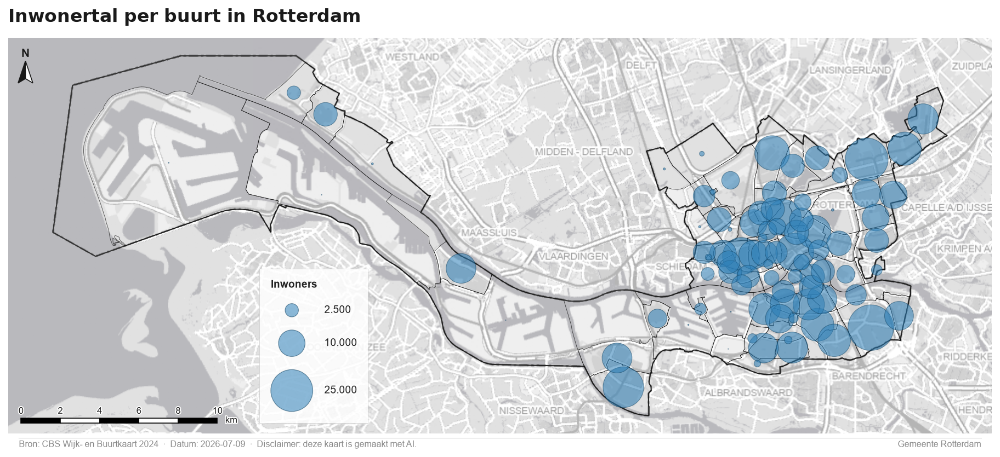
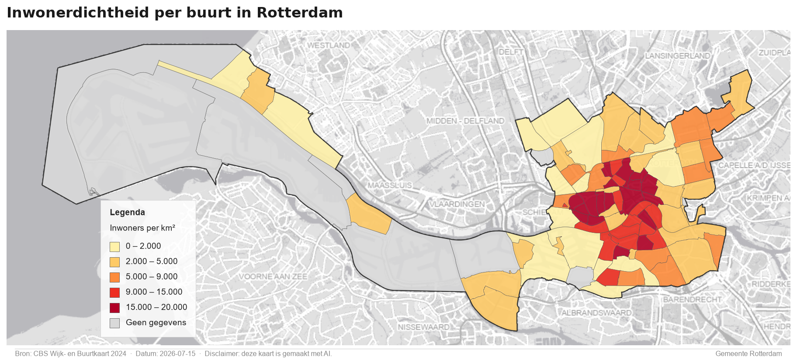
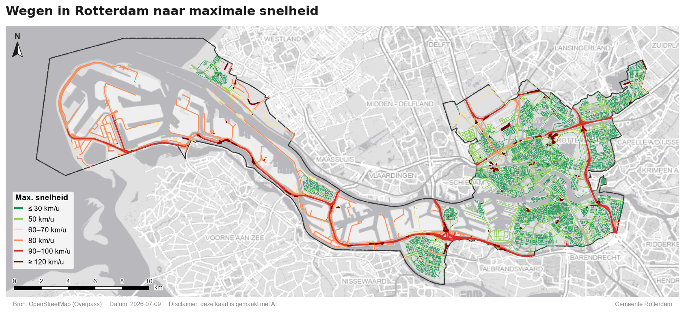
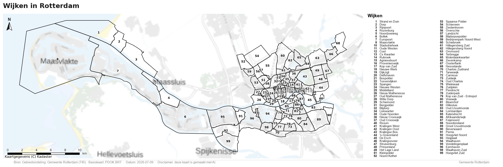
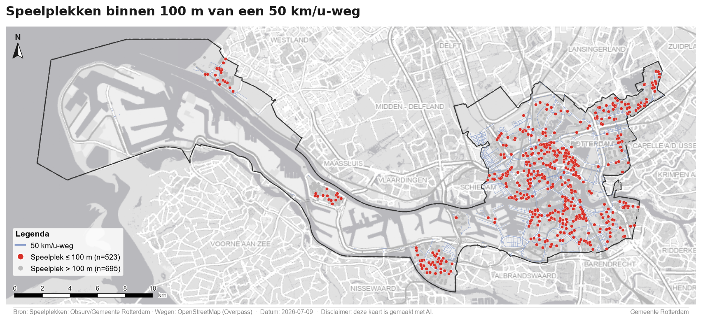
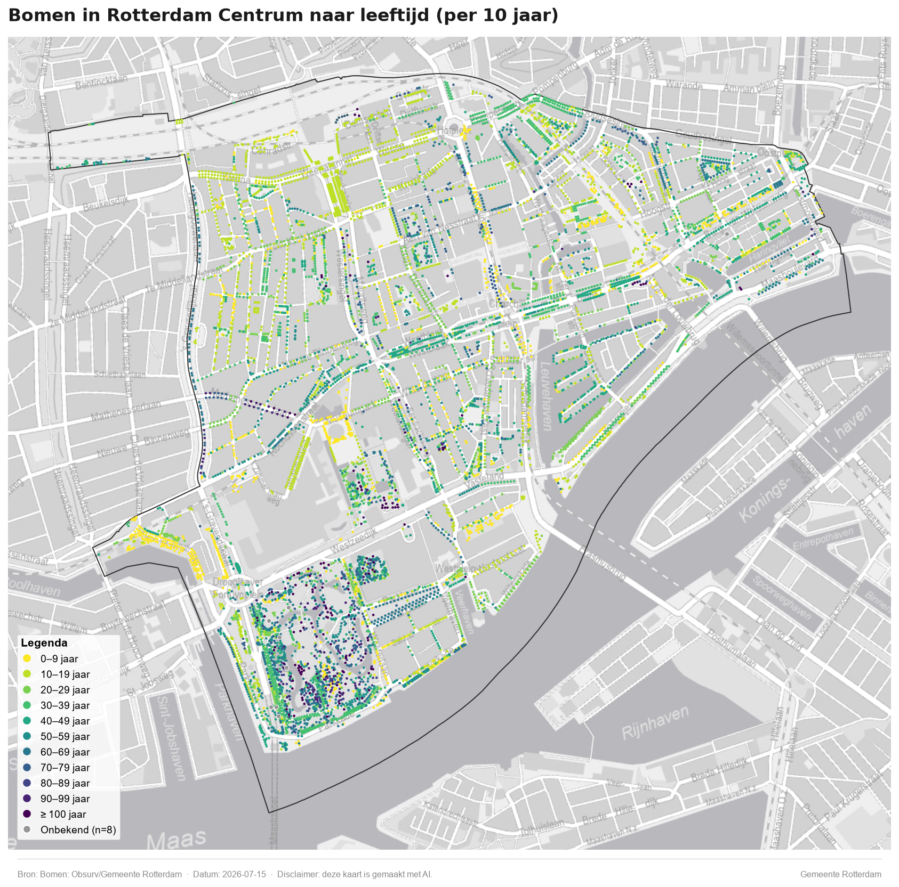
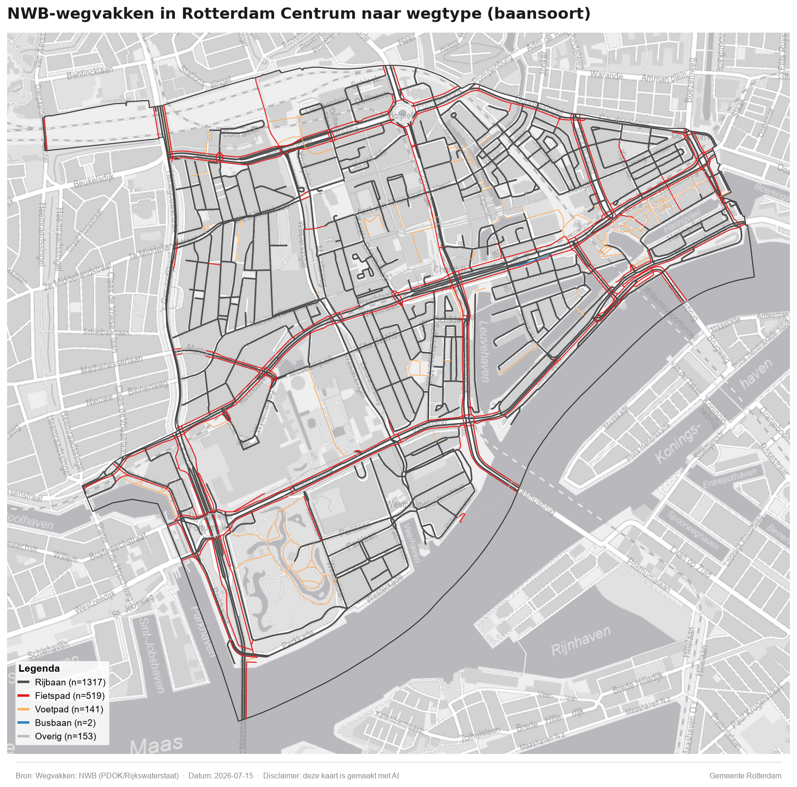

# GeoAI Rotterdam

Een toolkit + Claude Code–skill voor het maken van kaarten van Rotterdamse open
data (Stadsbeheer / Obsurv, CBS, PDOK, OSM, NWB). De herbruikbare Python-library
`rotterdam` (in [`General data/rotterdam/`](General%20data/rotterdam)) regelt data
inladen, cartografie (huisstijl, legenda-plaatsing, schaalstok, noordpijl, footer)
en het wegschrijven van kaarten. Losse kaartscripts staan in
[`output/scripts/`](output/scripts), de resultaten in [`output/maps/`](output/maps).

De cartografische conventies zijn vastgelegd als **invarianten** in de skill
([`.claude/skills/rotterdam-geoai/SKILL.md`](.claude/skills/rotterdam-geoai/SKILL.md)),
o.a.: choropleten altijd genormaliseerd, legenda nooit over de data
(hoek → kant → zijpaneel, met vaste marge tussen kaartelementen), basemap standaard
in kleur (grijs bij dichte thematische lagen), Nederlandse getalnotatie, en een
AI-disclaimer in de footer.

## Kaarten

| Kaart | Script |
|---|---|
| Inwonertal per buurt (proportionele cirkels, CBS 2024) | [`kaart_inwonertal_per_buurt_rotterdam.py`](output/scripts/kaart_inwonertal_per_buurt_rotterdam.py) |
| Inwonerdichtheid per buurt (choropleet, CBS 2024) | [`kaart_inwonerdichtheid_per_buurt_rotterdam.py`](output/scripts/kaart_inwonerdichtheid_per_buurt_rotterdam.py) |
| Wegen naar maximumsnelheid (OSM) | [`kaart_wegen_maxsnelheid_rotterdam.py`](output/scripts/kaart_wegen_maxsnelheid_rotterdam.py) |
| Alle wijken (grenzen + genummerde namenlijst) | [`kaart_wijken_rotterdam.py`](output/scripts/kaart_wijken_rotterdam.py) |
| Speelplekken binnen 100 m van een 50 km/u-weg | [`kaart_speelplekken_bij_50weg.py`](output/scripts/kaart_speelplekken_bij_50weg.py) |
| Bomen in Centrum naar leeftijd (per 10 jaar) | [`kaart_bomen_centrum_leeftijd.py`](output/scripts/kaart_bomen_centrum_leeftijd.py) |
| NWB-wegvakken Centrum naar wegtype | [`kaart_nwb_wegvakken_centrum_wegtype.py`](output/scripts/kaart_nwb_wegvakken_centrum_wegtype.py) |

### Inwonertal per buurt in Rotterdam
Proportionele cirkels (oppervlak ∝ inwonertal), CBS Wijk- en Buurtkaart 2024.



### Inwonerdichtheid per buurt in Rotterdam
Choropleet naar inwoners per km² (natural breaks), met een aparte klasse "Geen gegevens".



### Wegen in Rotterdam naar maximale snelheid
Alle wegen uit OpenStreetMap, geclassificeerd naar `maxspeed`.



### Wijken in Rotterdam
Alle wijken (zwarte grenzen) met wijknummer op de kaart en een genummerde naamlijst in het zijpaneel.



### Speelplekken binnen 100 m van een 50 km/u-weg
Ruimtelijke selectie: 523 van de 1.218 speelplekken liggen op ≤ 100 m van een 50 km/u-weg.



### Bomen in Rotterdam Centrum naar leeftijd
Ruim 9.000 bomen, geclassificeerd naar leeftijd (2026 − aanlegjaar) in stappen van 10 jaar, plus "Onbekend".



### NWB-wegvakken in Rotterdam Centrum naar wegtype
Wegvakken uit het Nationaal Wegenbestand (Rijkswaterstaat via PDOK), gecategoriseerd naar baansoort.



## Aan de slag

```bash
# vanuit de projectmap, met de Python-omgeving actief:
python "output/scripts/kaart_inwonertal_per_buurt_rotterdam.py"
```

Elk script voegt `General data` aan het pad toe en importeert uit `rotterdam`;
de kaart wordt naar `output/maps/` geschreven. Databronnen worden waar nodig
opgehaald (CBS/PDOK/OSM/NWB-webservices) en in `cache/` bewaard.

---

*Kaarten in deze repository zijn gemaakt met AI (Claude Code).*
